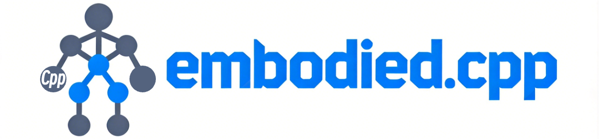

# Embodied.cpp 🤖

<p align="center">
  
</p>

[](LICENSE.md)
[](https://arxiv.org/abs/2607.02501)
[](https://huggingface.co/SEU-PAISys/Embodied.cpp)
<!-- Reserved for future badges:
[](#)
[](#)
[](#)
[](#)
[](#)
-->

`Embodied.cpp` is an inference runtime for **embodied AI models**: Vision-Language-Action (VLA) models and World-Action Models (WAMs) for robotic perception and control. It runs these models efficiently on heterogeneous hardware (CPU / CUDA GPU / NPU) using GGUF weights, and ships with ready-to-use servers and evaluation clients.

---

## Table of Contents

- [Embodied.cpp 🤖](#embodiedcpp-)
  - [Table of Contents](#table-of-contents)
  - [1. 🧭 Current Support and Roadmap](#1--current-support-and-roadmap)
    - [1.1 Model Support Roadmap](#11-model-support-roadmap)
    - [1.2 Runtime Roadmap](#12-runtime-roadmap)
  - [2. 🚀 Quick Start](#2--quick-start)
    - [2.1 Clone the Repo](#21-clone-the-repo)
    - [2.2 Get GGUF Weights](#22-get-gguf-weights)
    - [2.3 Install System Dependencies](#23-install-system-dependencies)
    - [2.4 Build by Model and Backend](#24-build-by-model-and-backend)
    - [2.5 Start a Server](#25-start-a-server)
    - [2.6 Evaluate in Simulation](#26-evaluate-in-simulation)
  - [3. 🧪 Evaluate in Simulation](#3--evaluate-in-simulation)
    - [3.1 LIBERO](#31-libero)
    - [3.2 RoboTwin](#32-robotwin)
  - [4. 🔧 Convert Your Own Model](#4--convert-your-own-model)
  - [5. 🗂️ Project Structure](#5-️-project-structure)
  - [6. 📄 Citation](#6--citation)
  - [7. ⚖️ License](#7-️-license)
  - [8. 🙏 Acknowledgements](#8--acknowledgements)

---

## 1. 🧭 Current Support and Roadmap

### 1.1 Model Support Roadmap
The table below summarizes the embodied AI model families that `Embodied.cpp` already supports and the ones we plan to support next. For a more detailed taxonomy and architectural discussion, please refer to our technical report.

<!-- Backup of the previous table before removing non-open-source models:
| Family | Subtype | Implemented | Planned |
|---|---|---|---|
| VLA | AR-Token VLA | - | [OpenVLA](https://github.com/openvla/openvla), [RT-2$\dagger$](https://arxiv.org/abs/2307.15818)|
| VLA | VLM-Backboned VLA | [pi0.5](https://github.com/Physical-Intelligence/openpi), [HY-VLA](https://github.com/Tencent-Hunyuan/Hy-Embodied-0.5-VLA) | [Octo](https://github.com/octo-models/octo), [MuseVLA$\dagger$](https://arxiv.org/abs/2606.17598) |
| VLA | Hierarchical VLA | - | [Hi Robot](https://arxiv.org/abs/2502.19417), [GeneralVLA](https://github.com/AIGeeksGroup/GeneralVLA-2), [RT-H$\dagger$](https://arxiv.org/abs/2403.01823), [Gemini Robotics 1.5$\dagger$](https://arxiv.org/abs/2510.03342) |
| VLA | Asynchronous VLA | - | [GR00T N1](https://developer.nvidia.com/isaac/gr00t), [Fast-in-Slow](https://github.com/CHEN-H01/Fast-in-Slow), [DAM-VLA$\dagger$](https://arxiv.org/abs/2606.12105) |
| WAM | Predict-then-Act WAM | - | [UniPi](https://github.com/flow-diffusion/AVDC_experiments/) |
| WAM | Unified AR-Modeling WAM | [LingBot-VA](https://github.com/robbyant/lingbot-va) | [WorldVLA](https://github.com/alibaba-damo-academy/RynnVLA-002) |
| WAM | Shared-Backbone WAM | - | [DreamZero](https://github.com/dreamzero0/dreamzero), [FastWAM](https://github.com/yuantianyuan01/FastWAM), [Cosmos Policy](https://github.com/nvlabs/cosmos-policy), [UWM](https://github.com/ShuangLI59/unified_video_action) |
| WAM | Latent-space WAM | - | [LaWAM$\dagger$](https://arxiv.org/abs/2606.15768), [Being-H0.7](https://github.com/BeingBeyond/Being-H) |
$\dagger$ We plan to support this model once it is open sourcece :)
-->

| Family | Subtype | Support ✅ | Planned 🚧 |
|---|---|---|---|
| VLA | AR-Token VLA | - | [OpenVLA](https://github.com/openvla/openvla) |
| VLA | VLM-Backboned VLA | [pi0.5](https://github.com/Physical-Intelligence/openpi), [HY-VLA](https://github.com/Tencent-Hunyuan/Hy-Embodied-0.5-VLA) | [Octo](https://github.com/octo-models/octo) |
| VLA | Hierarchical VLA | - | [Hi Robot](https://arxiv.org/abs/2502.19417), [GeneralVLA](https://github.com/AIGeeksGroup/GeneralVLA-2) |
| VLA | Asynchronous VLA | - | [GR00T N1](https://developer.nvidia.com/isaac/gr00t), [Fast-in-Slow](https://github.com/CHEN-H01/Fast-in-Slow) |
| WAM | Predict-then-Act WAM | - | [UniPi](https://github.com/flow-diffusion/AVDC_experiments/) |
| WAM | Unified AR-Modeling WAM | [LingBot-VA](https://github.com/robbyant/lingbot-va) | [WorldVLA](https://github.com/alibaba-damo-academy/RynnVLA-002) |
| WAM | Shared-Backbone WAM | - | [DreamZero](https://github.com/dreamzero0/dreamzero), [FastWAM](https://github.com/yuantianyuan01/FastWAM), [Cosmos Policy](https://github.com/nvlabs/cosmos-policy), [UWM](https://github.com/ShuangLI59/unified_video_action) |
| WAM | Latent-space WAM | - | [Being-H0.7](https://github.com/BeingBeyond/Being-H) |

### 1.2 Runtime Roadmap
- This part of the project is still under active construction 🚧
- [ ] A more modular and maintainable runtime architecture for `Embodied.cpp`
- [ ] Additional inference optimizations, such as real-time chunking and VLA caching
- [ ] More hardware backends, including Metal on macOS
---

## 2. 🚀 Quick Start

### 2.1 Clone the Repo

```bash
git clone <repo-url> && cd embodied.cpp
./patches/init_third_party.sh
```

### 2.2 Get GGUF Weights

Pre-converted GGUF releases for `Embodied.cpp` are available on Hugging Face:

- https://huggingface.co/SEU-PAISys/Embodied.cpp

The repository currently hosts GGUF artifacts prepared for the current
`Embodied.cpp` runtime, including:

- `pi0.5`: main policy GGUF plus multimodal projector GGUF
- `HY-VLA-0.5`: combined VLA GGUF for RoboTwin and related runtime paths
- `LingBot-VA`: transformer GGUF and companion artifacts used by the LingBot path

Recommended local layout:

```text
checkpoints/
  pi05/
    pi05.gguf
    pi05-mmproj.gguf
  Hy-Embodied-0.5-VLA-RoboTwin/
    Hy-Embodied-0.5-VLA-RoboTwin_bf16.gguf
    Hy-Embodied-0.5-VLA-RoboTwin_q4_K.gguf
  lingbot_va/
    lingbot_transformer.gguf
    ...
```

You can also convert upstream checkpoints yourself with the scripts in
[`scripts/`](scripts/), but for most users the Hugging Face GGUF releases are
the fastest way to get started.

### 2.3 Install System Dependencies

Install the required system packages for your platform before building.

**Linux:**
Make sure `cmake`, `protobuf`, `zeromq`, `cppzmq`, `pkg-config` and `uv` are available from your package manager before building.

**macOS (Apple Silicon, CPU-only verified for pi0.5):**
```bash
brew install cmake protobuf zeromq cppzmq pkg-config uv
```

### 2.4 Build by Model and Backend

Model switches default to `OFF`. Enable only the runtimes you need.

**pi0.5, CPU-only:**

```bash
cmake -S . -B build \
  -DCMAKE_BUILD_TYPE=Release \
  -DMODEL_BUILD_VLA_PI05=ON
cmake --build build --target vla-pi05-server -j$(nproc)
```

**pi0.5 on macOS / Apple Silicon, CPU-only:**

```bash
cmake -S . -B build \
  -DCMAKE_BUILD_TYPE=Release \
  -DMODEL_BUILD_VLA_PI05=ON
cmake --build build --target vla-pi05-server -j$(sysctl -n hw.logicalcpu)
```

**HY-VLA, CPU-only:**

```bash
cmake -S . -B build \
  -DCMAKE_BUILD_TYPE=Release \
  -DMODEL_BUILD_VLA_HY_VLA=ON
cmake --build build --target vla-hy-vla-server -j$(nproc)
```

**LingBot-VA, CPU-only:**

```bash
cmake -S . -B build \
  -DCMAKE_BUILD_TYPE=Release \
  -DMODEL_BUILD_WAM_LINGBOT_VA=ON
cmake --build build --target wam-lingbot-server -j$(nproc)
```

**HY-VLA + LingBot-VA, CUDA GPU:**

```bash
cmake -S . -B build \
  -DCMAKE_BUILD_TYPE=Release \
  -DMODEL_BUILD_VLA_HY_VLA=ON \
  -DMODEL_BUILD_WAM_LINGBOT_VA=ON \
  -DGGML_CUDA=ON \
  -DCMAKE_CUDA_COMPILER=/usr/local/cuda/bin/nvcc \
  -DCMAKE_CUDA_ARCHITECTURES=<your-arch> \
  -DProtobuf_PROTOC_EXECUTABLE=/usr/bin/protoc
cmake --build build --target vla-hy-vla-server wam-lingbot-server -j$(nproc)
```

If you want a single build with all currently supported runtimes enabled:

```bash
cmake -S . -B build \
  -DCMAKE_BUILD_TYPE=Release \
  -DMODEL_BUILD_VLA_PI05=ON \
  -DMODEL_BUILD_VLA_HY_VLA=ON \
  -DMODEL_BUILD_WAM_LINGBOT_VA=ON
cmake --build build --target vla-pi05-server vla-hy-vla-server wam-lingbot-server -j$(nproc)
```

### 2.5 Start a Server

```bash
# VLA server (pi0.5)
./build/vla-pi05-server \
  checkpoints/pi05/pi05-mmproj.gguf \
  checkpoints/pi05/pi05.gguf

# VLA server (HY-VLA)
./build/vla-hy-vla-server \
  checkpoints/Hy-Embodied-0.5-VLA-RoboTwin/Hy-Embodied-0.5-VLA-RoboTwin_bf16.gguf

# LingBot world-action server (bind to 5555 to match the client example below)
./build/wam-lingbot-server \
  --bind tcp://*:5555 \
  checkpoints/lingbot_va/lingbot_transformer.gguf
```

Each executable is generated only when its corresponding `MODEL_BUILD_*` switch
is enabled at configure time.

### 2.6 Evaluate in Simulation

**pi0.5 on LIBERO:**

```bash
# Start the pi0.5 server in another shell first.
./build/vla-pi05-server \
  checkpoints/pi05/pi05-mmproj.gguf \
  checkpoints/pi05/pi05.gguf

# Install the LIBERO runtime once
bash eval/sim/libero/setup_libero.sh

# Run one LIBERO smoke-test episode
eval/sim/libero/libero_uv/.venv/bin/python eval/client/run_sim_client_direct.py \
  --arch pi05 \
  --libero-suite object \
  --task-id 0 \
  --n-episodes 1 \
  --max-steps 80 \
  --seed 42 \
  --tokenizer lerobot/pi05_libero \
  --vla-addr tcp://127.0.0.1:5555
```

**HY-VLA on RoboTwin:**

```bash
# Build with MODEL_BUILD_VLA_HY_VLA=ON first, and use a HY-VLA GGUF from the
# released Embodied.cpp checkpoint set.

# Install the RoboTwin runtime once
bash eval/sim/robotwin/setup_robotwin.sh

# Run one RoboTwin episode
GGML_CUDA_DISABLE_GRAPHS=1 \
eval/sim/robotwin/robotwin_uv/.venv/bin/python \
  eval/client/run_robotwin_eval.py \
  --model checkpoints/Hy-Embodied-0.5-VLA-RoboTwin/Hy-Embodied-0.5-VLA-RoboTwin_bf16.gguf \
  --task-name place_empty_cup \
  --episodes 1
```

**LingBot-VA on LIBERO:**

```bash
# Install the LIBERO runtime once
bash eval/sim/libero/setup_libero.sh

# Run a test episode
eval/sim/libero/libero_uv/.venv/bin/python eval/client/run_sim_client_direct.py \
  --arch lingbot_va \
  --libero-suite object \
  --task-id 0 \
  --n-episodes 1 \
  --tokenizer /path/to/lingbot-va-tokenizer \
  --vla-addr tcp://localhost:5555
```
---

## 3. 🧪 Evaluate in Simulation

### 3.1 LIBERO

LIBERO tests robotic manipulation skills on four task suites: `spatial`, `object`, `goal`, and `10`. A fifth suite `long` (90 tasks) is also available.

```bash
--libero-suite spatial  → libero_spatial
--libero-suite object   → libero_object
--libero-suite goal     → libero_goal
--libero-suite 10       → libero_10
--libero-suite long     → libero_90
```

Use `--task-id 0..9` (or `0..89` for `long`) to select an individual task.

The direct simulation client currently supports:

- `--arch pi05`
- `--arch lingbot_va`

Example pi0.5 smoke test:

```bash
eval/sim/libero/libero_uv/.venv/bin/python eval/client/run_sim_client_direct.py \
  --arch pi05 \
  --libero-suite object \
  --task-id 0 \
  --n-episodes 1 \
  --max-steps 80 \
  --tokenizer lerobot/pi05_libero \
  --vla-addr tcp://127.0.0.1:5555 \
  --output-dir outputs/pi05_libero_smoke
```

### 3.2 RoboTwin

RoboTwin is a dual-arm robot benchmark with real-world-style manipulation tasks. Run HY-VLA natively in C++:

```bash
bash eval/sim/robotwin/setup_robotwin.sh   # one-time setup

GGML_CUDA_DISABLE_GRAPHS=1 \
eval/sim/robotwin/robotwin_uv/.venv/bin/python \
  eval/client/run_robotwin_eval.py \
  --model <path-to-hy-vla.gguf> \
  --task-name place_empty_cup \
  --episodes 1
```

See [`eval/sim/robotwin/README.md`](eval/sim/robotwin/README.md) for detailed setup modes and troubleshooting.

## 4. 🔧 Convert Your Own Model

GGUF conversion scripts are in [`scripts/`](scripts/):

| Script | Converts |
|---|---|
| `convert_pi05_to_gguf.py` | pi0.5 model weights |
| `convert_pi05_mmproj_to_gguf.py` | pi0.5 multimodal projector |
| `convert_hy_vla_to_gguf.py` | HY-VLA combined vision+action |
| `convert_lingbot_va_to_gguf.py` | LingBot-VA transformer + companion GGUFs |

Quantization helpers:

| Script | Quantizes |
|---|---|
| `quantize_hy_vla_gguf.py` | HY-VLA models |
| `quantize_lingbot_wan_gguf.py` | LingBot-VA models |

If you do not need a custom conversion, prefer the prebuilt GGUF releases at:

- https://huggingface.co/SEU-PAISys/Embodied.cpp

## 5. 🗂️ Project Structure

What lives where, in plain language:

| Directory | What it contains |
|---|---|
| `models/` | C++ model implementations (pi0.5, HY-VLA, LingBot-VA) |
| `runtime/` | Model registry, architecture detection, shared utilities |
| `adapter/` | I/O boundary — translates sensor/simulator data into typed inputs the models understand |
| `serving/` | Server code (ZeroMQ/Protobuf) for VLA and LingBot APIs |
| `kernels/` | Custom CUDA kernels (used when building with GPU support) |
| `scripts/` | GGUF conversion, quantization, and evaluation helpers |
| `patches/` | Third-party code patches applied during setup |
| `eval/` | Evaluation clients and simulation setups (LIBERO, RoboTwin) |

## 6. 📄 Citation

If you find `Embodied.cpp` useful in your research, please consider citing:

```bibtex
@article{xu2026embodiedcpp,
  title={Embodied.cpp: A Portable Inference Runtime of Embodied AI Models on Heterogeneous Robots},
  author={Xu, Ling and Han, Chuyu and Li, Borui and Wu, Hao and Jiang, Shiqi and Cao, Ting and Li, Chuanyou and Zhong, Sheng and Wang, Shuai},
  journal={arXiv preprint arXiv:2607.02501},
  year={2026},
  doi={10.48550/arXiv.2607.02501},
  url={https://arxiv.org/abs/2607.02501}
}
```

## 7. ⚖️ License

This project is released under the [Apache License 2.0](LICENSE.md). Third-party dependencies, model checkpoints, datasets, and upstream reference implementations are distributed under their own licenses.

## 8. 🙏 Acknowledgements

**Supported models:**
- [pi0.5 / OpenPI](https://github.com/Physical-Intelligence/openpi)
- [HY-VLA](https://github.com/Tencent-Hunyuan/Hy-Embodied-0.5-VLA)
- [LingBot-VA](https://github.com/robbyant/lingbot-vla)

**Foundational projects this build depends on:**
- [llama.cpp](https://github.com/ggml-org/llama.cpp) (LLM inference engine)
- [vla.cpp](https://github.com/VinRobotics/vla.cpp) (unified VLA runtime)
- [LIBERO](https://github.com/Lifelong-Robot-Learning/LIBERO) (manipulation benchmark)
- [RoboTwin](https://github.com/RoboTwin-Platform/RoboTwin) (dual-arm robot benchmark)
