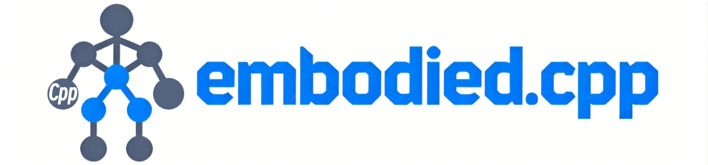

# Embodied.cpp 🤖

<p align="center">
  
</p>

[](LICENSE.md)
[](https://arxiv.org/abs/2607.02501)
[](https://huggingface.co/SEU-PAISys/Embodied.cpp)
<!-- Reserved for future badges:
[](#)
[](#)
[](#)
[](#)
[](#)
-->

`Embodied.cpp` is an inference runtime for **embodied AI models**: Vision-Language-Action (VLA) models and World-Action Models (WAMs) for robotic perception and control. It runs these models efficiently on heterogeneous hardware (CPU / CUDA GPU / NPU) using GGUF weights, and ships with ready-to-use servers and evaluation clients.

---
## NEWS

- **[2026.08]** 🔥🔥 Released Embodied.cpp v0.1.
- **[2026.07]** Added support for **Cosmos3-Nano** and **GR00T N1.7**, the **RoboLab** benchmark, and Isaac Sim.
- **[2026.06]** Released the initial version of Embodied.cpp with support for **pi0.5**, **HY-VLA**, and **LingBot-VA**, plus the **LIBERO** and **RoboTwin** benchmarks.

---

## 🎬 Demos

### GR00T N1.7

https://github.com/user-attachments/assets/0a429ad6-d41a-4ea6-aaa7-30cd4bc48b23

### HY-VLA

https://github.com/user-attachments/assets/3f74a1cb-5536-43fb-87c6-8802dbda42f0

### pi0.5

https://github.com/user-attachments/assets/e6f8605b-90a2-43eb-91f4-92c5965836a4

---

## Table of Contents

- [Embodied.cpp 🤖](#embodiedcpp-)
  - [NEWS](#news)
  - [Demos](#-demos)
  - [Table of Contents](#table-of-contents)
  - [1. 🧭 Current Support and Roadmap](#1--current-support-and-roadmap)
    - [1.1 Model Support Roadmap](#11-model-support-roadmap)
    - [1.2 Runtime Roadmap](#12-runtime-roadmap)
  - [2. 🚀 Quick Start](#2--quick-start)
    - [2.1 Clone the Repo](#21-clone-the-repo)
    - [2.2 Get GGUF Weights](#22-get-gguf-weights)
    - [2.3 Install System Dependencies](#23-install-system-dependencies)
    - [2.4 Build by Model and Backend](#24-build-by-model-and-backend)
    - [2.5 Start a Server](#25-start-a-server)
  - [3. 🧪 Evaluation](#3--evaluation)
    - [3.1 LIBERO](#31-libero)
    - [3.2 RoboTwin](#32-robotwin)
    - [3.3 RoboLab (Cosmos3-Nano)](#33-robolab-cosmos3-nano)
  - [4. 🔧 Convert and Quantize Models](#4--convert-and-quantize-models)
  - [5. 🗂️ Project Structure](#5-️-project-structure)
  - [6. 📄 Citation](#6--citation)
  - [7. ⚖️ License](#7-️-license)
  - [8. 🙏 Acknowledgements](#8--acknowledgements)

---

## 1. 🧭 Current Support and Roadmap

### 1.1 Model Support Roadmap
The table below summarizes the embodied AI model families that `Embodied.cpp` already supports and the ones we plan to support next. For a more detailed taxonomy and architectural discussion, please refer to our technical report.

<!-- Backup of the previous table before removing non-open-source models:
| Family | Subtype | Implemented | Planned |
|---|---|---|---|
| VLA | AR-Token VLA | - | [OpenVLA](https://github.com/openvla/openvla), [RT-2$\dagger$](https://arxiv.org/abs/2307.15818)|
| VLA | VLM-Backboned VLA | [pi0.5](https://github.com/Physical-Intelligence/openpi), [HY-VLA](https://github.com/Tencent-Hunyuan/Hy-Embodied-0.5-VLA) | [Octo](https://github.com/octo-models/octo), [MuseVLA$\dagger$](https://arxiv.org/abs/2606.17598) |
| VLA | Hierarchical VLA | - | [Hi Robot](https://arxiv.org/abs/2502.19417), [GeneralVLA](https://github.com/AIGeeksGroup/GeneralVLA-2), [RT-H$\dagger$](https://arxiv.org/abs/2403.01823), [Gemini Robotics 1.5$\dagger$](https://arxiv.org/abs/2510.03342) |
| VLA | Asynchronous VLA | - | [GR00T N1](https://developer.nvidia.com/isaac/gr00t), [Fast-in-Slow](https://github.com/CHEN-H01/Fast-in-Slow), [DAM-VLA$\dagger$](https://arxiv.org/abs/2606.12105) |
| WAM | Predict-then-Act WAM | - | [UniPi](https://github.com/flow-diffusion/AVDC_experiments/) |
| WAM | Unified AR-Modeling WAM | [LingBot-VA](https://github.com/robbyant/lingbot-va) | [WorldVLA](https://github.com/alibaba-damo-academy/RynnVLA-002) |
| WAM | Shared-Backbone WAM | - | [DreamZero](https://github.com/dreamzero0/dreamzero), [FastWAM](https://github.com/yuantianyuan01/FastWAM), [Cosmos Policy](https://github.com/nvlabs/cosmos-policy), [UWM](https://github.com/ShuangLI59/unified_video_action) |
| WAM | Latent-space WAM | - | [LaWAM$\dagger$](https://arxiv.org/abs/2606.15768), [Being-H0.7](https://github.com/BeingBeyond/Being-H) |
$\dagger$ We plan to support this model once it is open sourcece :)
-->

| Family | Subtype | Support ✅ | Planned 🚧 |
|---|---|---|---|
| VLA | AR-Token VLA | - | [OpenVLA](https://github.com/openvla/openvla) |
| VLA | VLM-Backboned VLA | [pi0.5](https://github.com/Physical-Intelligence/openpi), [HY-VLA](https://github.com/Tencent-Hunyuan/Hy-Embodied-0.5-VLA) | [Octo](https://github.com/octo-models/octo) |
| VLA | Hierarchical VLA | - | [Hi Robot](https://arxiv.org/abs/2502.19417), [GeneralVLA](https://github.com/AIGeeksGroup/GeneralVLA-2) |
| VLA | Asynchronous VLA | [GR00T N1.7](https://developer.nvidia.com/isaac/gr00t) | [Fast-in-Slow](https://github.com/CHEN-H01/Fast-in-Slow) |
| WAM | Predict-then-Act WAM | - | [UniPi](https://github.com/flow-diffusion/AVDC_experiments/) |
| WAM | Unified AR-Modeling WAM | [LingBot-VA](https://github.com/robbyant/lingbot-va) | [WorldVLA](https://github.com/alibaba-damo-academy/RynnVLA-002) |
| WAM | Shared-Backbone WAM | [Cosmos3-Nano(full_w8 version)](https://github.com/nvidia/cosmos) | [DreamZero](https://github.com/dreamzero0/dreamzero), [FastWAM](https://github.com/yuantianyuan01/FastWAM), [UWM](https://github.com/ShuangLI59/unified_video_action) |
| WAM | Latent-space WAM | - | [Being-H0.7](https://github.com/BeingBeyond/Being-H) |

### 1.2 Runtime Roadmap
- This part of the project is still under active construction 🚧
- [ ] A more modular and maintainable runtime architecture for `Embodied.cpp`
- [ ] Additional inference optimizations, such as real-time chunking and VLA caching
- [ ] More hardware backends, including Metal on macOS
---

## 2. 🚀 Quick Start

### 2.1 Clone the Repo

```bash
git clone <repo-url> && cd embodied.cpp
./patches/init_third_party.sh
```

By default, the setup script prepares a combined `llama.cpp` source tree for all
supported runtimes. For smaller model-specific setups or custom patch profiles,
see [`patches/PATCH.md`](patches/PATCH.md).

### 2.2 Get GGUF Weights

Pre-converted GGUF releases for `Embodied.cpp` are available on Hugging Face:

- https://huggingface.co/SEU-PAISys/Embodied.cpp

The repository currently hosts GGUF artifacts prepared for the current
`Embodied.cpp` runtime, including:

- `pi0.5`: main policy GGUF plus multimodal projector GGUF
- `GR00T N1.7`: truncated Qwen3-VL text GGUF, vision projector GGUF, and action-head GGUF
- `HY-VLA-0.5`: combined VLA GGUF for RoboTwin and related runtime paths
- `LingBot-VA`: transformer GGUF and companion artifacts used by the LingBot path
- `Cosmos3-Nano`: RoboLab WAM GGUF with the Wan VAE encoder

Recommended local layout:

```text
checkpoints/
  pi05/
    pi05.gguf
    pi05-mmproj.gguf
  groot-n1/
    qwen3vl-backbone-bf16.gguf
    qwen3vl-mmproj-bf16.gguf
    groot-n1.7-libero-object-action-head-bf16.gguf
  Hy-Embodied-0.5-VLA-RoboTwin/
    Hy-Embodied-0.5-VLA-RoboTwin_bf16.gguf
    Hy-Embodied-0.5-VLA-RoboTwin_q4_K.gguf
  lingbot_va/
    lingbot_transformer.gguf
    ...
  cosmos3/
    cosmos3_robolab_full_w8_with_vae_encoder.gguf
```

You can also convert upstream checkpoints yourself with the scripts in
[`scripts/`](scripts/), but for most users the Hugging Face GGUF releases are
the fastest way to get started.

### 2.3 Install System Dependencies

Install the required system packages for your platform before building.

Minimum build requirements:

- CMake >= 3.22
- A C++17 compiler, such as GCC 11+ or Clang 14+
- CUDA 12.x, optional and required only for GPU builds

**Linux:**
Make sure `cmake`, `protobuf=3.20.3`, `zeromq`, `cppzmq`, `pkg-config` and `uv` are
available before building. A typical Ubuntu/Debian native-Linux installation is:

```bash
sudo apt-get update
sudo apt-get install -y \
  build-essential cmake pkg-config protobuf-compiler libprotobuf-dev \
  libzmq3-dev cppzmq-dev libegl1-mesa-dev libglu1-mesa-dev \
  libgl1-mesa-dev ffmpeg iproute2
```

CUDA runs additionally require an NVIDIA driver, a compatible CUDA toolkit,
and `nvidia-smi`. Install `uv` separately if your distribution does not package
it.


### 2.4 Build by Model and Backend

Model switches default to `OFF`. Enable only the runtimes you need.

**CUDA GPU template:**

```bash
CUDA_HOME="${CUDA_HOME:-$(dirname "$(dirname "$(command -v nvcc)")")}"
CUDA_ARCH=${CUDA_ARCH:-native}

cmake -S . -B <BUILD_DIR> \
  -DCMAKE_BUILD_TYPE=Release \
  -D<MODEL_BUILD_FLAG>=ON \
  -DGGML_CUDA=ON \
  -DCMAKE_CUDA_COMPILER="${CUDA_HOME}/bin/nvcc" \
  -DCMAKE_CUDA_ARCHITECTURES="${CUDA_ARCH}"
cmake --build <BUILD_DIR> --target <SERVER_TARGET> -j$(nproc)
```

Use a separate `<BUILD_DIR>` for each model or CMake configuration, such as
`build-groot-cuda` or `build-lingbot-cuda`; a build directory stores one CMake
configuration and its generated artifacts.

Replace the placeholders with the model you want to build:

| Model | `<MODEL_BUILD_FLAG>` | `<SERVER_TARGET>` |
|---|---|---|
| pi0.5 | `MODEL_BUILD_VLA_PI05` | `vla-server` |
| HY-VLA | `MODEL_BUILD_VLA_HY_VLA` | `vla-server` |
| GR00T N1.7 | `MODEL_BUILD_VLA_GROOT_N1` | `vla-server` |
| LingBot-VA | `MODEL_BUILD_WAM_LINGBOT_VA` | `wam-lingbot-server` |
| Cosmos3-Nano | `MODEL_BUILD_WAM_COSMOS3` | `wam-server` |

`CUDA_ARCH` defaults to `native`, so CMake detects the GPU installed on the
build machine. Override it with an explicit architecture when cross-compiling or
when using CMake older than 3.24. Common explicit values include `75` (Turing),
`80` or `86` (Ampere), `89` (Ada), `90` (Hopper), and `120` (Blackwell). The
selected CUDA toolkit must support that architecture; for example, Blackwell
`sm_120` requires CUDA 12.8 or newer.

### 2.5 Start a Server

```bash
./<BUILD_DIR>/<SERVER_TARGET> <MODEL_ARGUMENTS>
```

Use the `<BUILD_DIR>` and `<SERVER_TARGET>` selected in section 2.4. Replace
`<MODEL_ARGUMENTS>` with the arguments for the selected model:

| Model | `<SERVER_TARGET>` | `<MODEL_ARGUMENTS>` |
|---|---|---|
| pi0.5 | `vla-server` | `<MMPROJ_GGUF> <MODEL_GGUF>` |
| HY-VLA | `vla-server` | `<MODEL_GGUF>` |
| GR00T N1.7 | `vla-server` | `--backbone <BACKBONE_GGUF> <MMPROJ_GGUF> <ACTION_HEAD_GGUF>` |
| LingBot-VA | `wam-lingbot-server` | `<TRANSFORMER_GGUF> <TEXT_ENCODER_GGUF> <VAE_ENCODER_GGUF>` |
| Cosmos3-Nano | `wam-server` | `<MODEL_GGUF>` |

VLA servers bind to `tcp://*:5555` by default. LingBot-VA and Cosmos3-Nano
bind to `tcp://*:5557` by default. Pass `--bind <ADDR>` to override the
listening address or port.

## 3. 🧪 Evaluation

Start the required server as described in section 2.5, then select the
configuration and runner for the model and benchmark you want to evaluate.

| Model | Benchmark | Configuration | Server |
|---|---|---|---|
| pi0.5 | LIBERO | [pi0.5](eval/conf/libero_pi05_eval.yaml) | Manual |
| GR00T N1.7 | LIBERO | [GR00T](eval/conf/libero_groot_n1_eval.yaml) | Manual |
| LingBot-VA | LIBERO | [LingBot](eval/conf/libero_lingbot_va_eval.yaml) | Manual |
| HY-VLA | RoboTwin | [HY-VLA](eval/conf/robotwin_hy_vla_eval.yaml) | Managed |
| Cosmos3-Nano | RoboLab | [Cosmos3](eval/conf/robolab_cosmos3_eval.yaml) | Managed |

LIBERO uses `eval/client/run_sim_client_direct.py`; start its matching server
separately. RoboTwin and RoboLab runners start their servers from the selected
configuration and stop them when the evaluation finishes.

Each checked-in YAML is a baseline evaluation configuration. Adjust its task
selection, episode count, model paths, output location, and other
benchmark-specific settings for your run; the exact field names are documented
in the corresponding configuration and simulator README.

### 3.1 LIBERO

LIBERO tests robotic manipulation skills on the `spatial`, `object`, `goal`,
`short`, and `long` suites. Install the simulator once:

```bash
bash eval/sim/libero/setup_libero.sh
```

After starting the matching server in another terminal, run a checked-in
configuration:

```bash
# pi0.5
eval/sim/libero/libero_uv/.venv/bin/python eval/client/run_sim_client_direct.py \
  --conf eval/conf/libero_pi05_eval.yaml

# GR00T N1.7
eval/sim/libero/libero_uv/.venv/bin/python eval/client/run_sim_client_direct.py \
  --conf eval/conf/libero_groot_n1_eval.yaml

# LingBot-VA
eval/sim/libero/libero_uv/.venv/bin/python eval/client/run_sim_client_direct.py \
  --conf eval/conf/libero_lingbot_va_eval.yaml
```

See [`eval/sim/libero/README.md`](eval/sim/libero/README.md) for LIBERO suite
selection, headless EGL execution, and configuration details.

### 3.2 RoboTwin

RoboTwin is a dual-arm manipulation benchmark. Install it once:

```bash
bash eval/sim/robotwin/setup_robotwin.sh
```

Run HY-VLA with the standard configuration:

```bash
eval/sim/robotwin/robotwin_uv/.venv/bin/python \
  eval/client/run_robotwin_eval.py \
  --conf eval/conf/robotwin_hy_vla_eval.yaml
```

See [`eval/sim/robotwin/README.md`](eval/sim/robotwin/README.md) for detailed setup modes and troubleshooting.

### 3.3 RoboLab (Cosmos3-Nano)

RoboLab evaluates the native C++ Cosmos3 WAM path. Install RoboLab once
without launching its optional Isaac Sim smoke test:

```bash
RUN_SMOKE_TEST=0 bash eval/sim/robolab/setup_robolab.sh
```

Run Cosmos3-Nano with the standard configuration:

```bash
python3 eval/client/run_robolab_eval.py \
  --conf eval/conf/robolab_cosmos3_eval.yaml
```

The runner starts the C++ `wam-server` automatically. See
[`eval/sim/robolab/README.md`](eval/sim/robolab/README.md) for configuration
details, the transport-only smoke test, and the PyTorch-reference path.

## 4. 🔧 Convert and Quantize Models

Pre-converted GGUF releases are available on
[Hugging Face](https://huggingface.co/SEU-PAISys/Embodied.cpp). Use the
conversion tools only when preparing a compatible upstream checkpoint or a
custom quantization.

| Model | Workflow |
|---|---|
| pi0.5 | [Policy and vision projector](scripts/README.md#pi05) |
| GR00T N1.7 | [Action head and Qwen3-VL backbone](scripts/README.md#groot-n17) |
| HY-VLA | [Combined GGUF and quantization](scripts/README.md#hy-vla) |
| LingBot-VA | [Model artifacts and Wan quantization](scripts/README.md#lingbot-va) |
| Cosmos3-Nano | [RoboLab full_w8 GGUF](scripts/README.md#cosmos3-nano) |

See [`scripts/README.md`](scripts/README.md) for prerequisites, commands,
expected outputs, and post-conversion checks.

## 5. 🗂️ Project Structure

What lives where, in plain language:

| Directory | What it contains |
|---|---|
| `models/` | C++ implementations of supported models |
| `runtime/` | Model registry, architecture detection, shared utilities |
| `adapter/` | Typed I/O boundary between observations and model inputs |
| `serving/` | ZeroMQ/Protobuf inference servers and API definitions |
| `kernels/` | Custom CUDA kernels for GPU builds |
| `scripts/` | GGUF conversion and quantization tools |
| `patches/` | Third-party setup patches |
| `eval/` | Evaluation clients, configurations, and simulator integrations |

## 6. 📄 Citation

If you find `Embodied.cpp` useful in your research, please consider citing:

```bibtex
@article{xu2026embodiedcpp,
  title={Embodied.cpp: A Portable Inference Runtime of Embodied AI Models on Heterogeneous Robots},
  author={Xu, Ling and Han, Chuyu and Li, Borui and Wu, Hao and Jiang, Shiqi and Cao, Ting and Li, Chuanyou and Zhong, Sheng and Wang, Shuai},
  journal={arXiv preprint arXiv:2607.02501},
  year={2026},
  doi={10.48550/arXiv.2607.02501},
  url={https://arxiv.org/abs/2607.02501}
}
```

## 7. ⚖️ License

This project is released under the [Apache License 2.0](LICENSE.md). Third-party dependencies, model checkpoints, datasets, and upstream reference implementations are distributed under their own licenses.

## 8. 🙏 Acknowledgements

**Supported models:**
- [pi0.5 / OpenPI](https://github.com/Physical-Intelligence/openpi)
- [NVIDIA Isaac GR00T](https://github.com/NVIDIA/Isaac-GR00T)
- [HY-VLA](https://github.com/Tencent-Hunyuan/Hy-Embodied-0.5-VLA)
- [LingBot-VA](https://github.com/robbyant/lingbot-vla)
- [NVIDIA Cosmos / Cosmos3-Nano](https://github.com/nvidia/cosmos)

**Foundational projects this build depends on:**
- [llama.cpp](https://github.com/ggml-org/llama.cpp) (LLM inference engine)
- [vla.cpp](https://github.com/VinRobotics/vla.cpp) (unified VLA runtime)
- [LIBERO](https://github.com/Lifelong-Robot-Learning/LIBERO) (manipulation benchmark)
- [RoboTwin](https://github.com/RoboTwin-Platform/RoboTwin) (dual-arm robot benchmark)
- [RoboLab](https://github.com/NVlabs/RoboLab) (Isaac Sim DROID evaluation benchmark)
