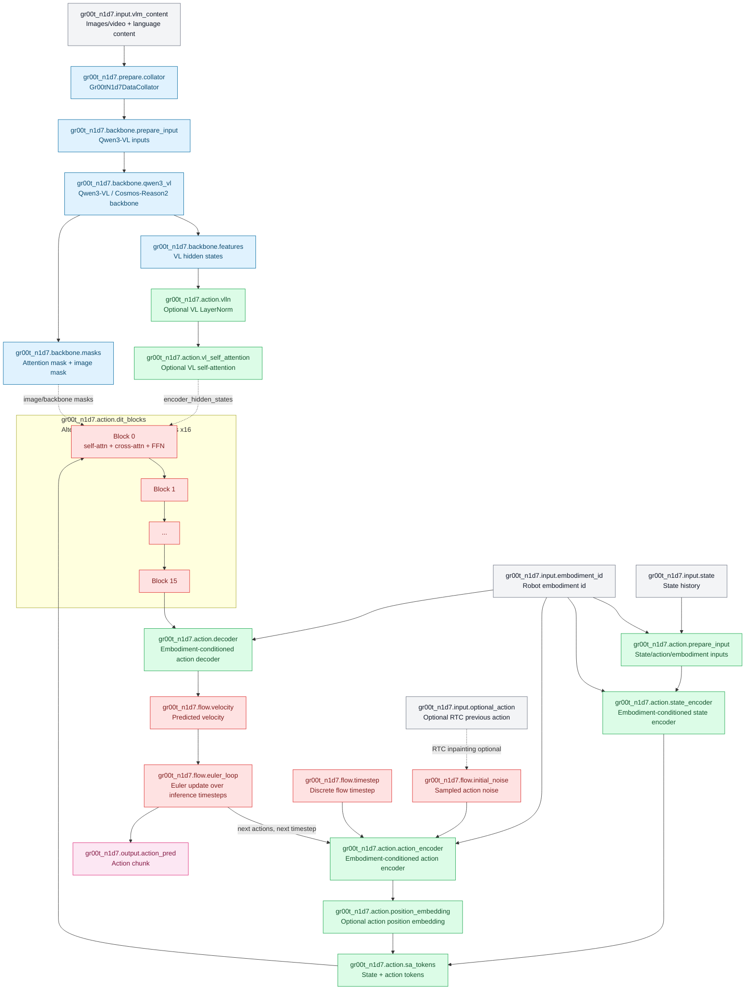

```mermaid
flowchart TD
    vlm_content["gr00t_n1d7.input.vlm_content<br/>Images/video + language content"]
    state["gr00t_n1d7.input.state<br/>State history"]
    embodiment["gr00t_n1d7.input.embodiment_id<br/>Robot embodiment id"]
    prev_action["gr00t_n1d7.input.optional_action<br/>Optional RTC previous action"]

    collator["gr00t_n1d7.prepare.collator<br/>Gr00tN1d7DataCollator"]
    backbone_prep["gr00t_n1d7.backbone.prepare_input<br/>Qwen3-VL inputs"]
    action_prep["gr00t_n1d7.action.prepare_input<br/>State/action/embodiment inputs"]

    qwen["gr00t_n1d7.backbone.qwen3_vl<br/>Qwen3-VL / Cosmos-Reason2 backbone"]
    vl_feats["gr00t_n1d7.backbone.features<br/>VL hidden states"]
    vl_mask["gr00t_n1d7.backbone.masks<br/>Attention mask + image mask"]

    vlln["gr00t_n1d7.action.vlln<br/>Optional VL LayerNorm"]
    vl_self["gr00t_n1d7.action.vl_self_attention<br/>Optional VL self-attention"]
    state_enc["gr00t_n1d7.action.state_encoder<br/>Embodiment-conditioned state encoder"]

    noise["gr00t_n1d7.flow.initial_noise<br/>Sampled action noise"]
    t["gr00t_n1d7.flow.timestep<br/>Discrete flow timestep"]
    action_enc["gr00t_n1d7.action.action_encoder<br/>Embodiment-conditioned action encoder"]
    pos["gr00t_n1d7.action.position_embedding<br/>Optional action position embedding"]
    sa["gr00t_n1d7.action.sa_tokens<br/>State + action tokens"]

    decoder["gr00t_n1d7.action.decoder<br/>Embodiment-conditioned action decoder"]
    vel["gr00t_n1d7.flow.velocity<br/>Predicted velocity"]
    euler["gr00t_n1d7.flow.euler_loop<br/>Euler update over inference timesteps"]
    out["gr00t_n1d7.output.action_pred<br/>Action chunk"]

    subgraph dit_stack["gr00t_n1d7.action.dit_blocks<br/>AlternateVLDiT / DiT transformer blocks x16"]
        dit_b0["Block 0<br/>self-attn + cross-attn + FFN"]
        dit_b1["Block 1"]
        dit_dots["..."]
        dit_b15["Block 15"]
        dit_b0 --> dit_b1 --> dit_dots --> dit_b15
    end

    vlm_content --> collator --> backbone_prep --> qwen --> vl_feats --> vlln --> vl_self
    qwen --> vl_mask
    state --> action_prep --> state_enc --> sa
    embodiment --> action_prep
    embodiment --> state_enc
    embodiment --> action_enc
    embodiment --> decoder
    prev_action -. RTC inpainting optional .-> noise
    noise --> action_enc
    t --> action_enc
    action_enc --> pos --> sa
    vl_self -. encoder_hidden_states .-> dit_b0
    vl_mask -. image/backbone masks .-> dit_b0
    sa --> dit_b0
    dit_b15 --> decoder --> vel --> euler --> out
    euler -- next actions, next timestep --> action_enc

    classDef input fill:#f3f4f6,stroke:#6b7280,color:#111827;
    classDef vision fill:#e0f2fe,stroke:#0369a1,color:#0c4a6e;
    classDef action fill:#dcfce7,stroke:#16a34a,color:#14532d;
    classDef flow fill:#fee2e2,stroke:#dc2626,color:#7f1d1d;
    classDef output fill:#fce7f3,stroke:#db2777,color:#831843;

    class vlm_content,state,embodiment,prev_action input;
    class collator,backbone_prep,qwen,vl_feats,vl_mask vision;
    class action_prep,vlln,vl_self,state_enc,action_enc,pos,sa,decoder action;
    class noise,t,dit_b0,dit_b1,dit_dots,dit_b15,vel,euler flow;
    class out output;
```
