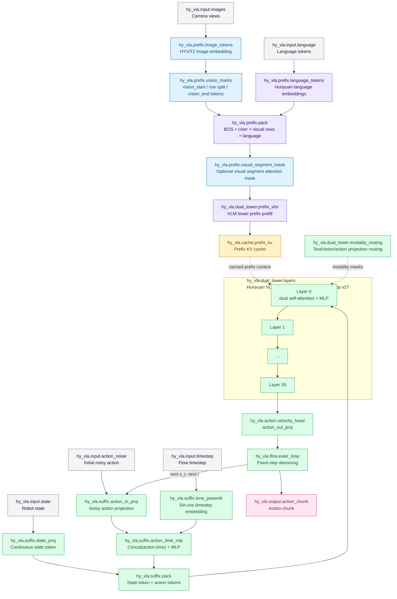

```mermaid
flowchart TD
    img["hy_vla.input.images<br/>Camera views"]
    lang["hy_vla.input.language<br/>Language tokens"]
    state["hy_vla.input.state<br/>Robot state"]
    noise["hy_vla.input.action_noise<br/>Initial noisy action"]
    step_t["hy_vla.input.timestep<br/>Flow timestep"]

    img_tok["hy_vla.prefix.image_tokens<br/>HYViT2 image embedding"]
    vision_marks["hy_vla.prefix.vision_marks<br/>vision_start / row split / vision_end tokens"]
    lang_tok["hy_vla.prefix.language_tokens<br/>Hunyuan language embeddings"]
    prefix_pack["hy_vla.prefix.pack<br/>BOS + User + visual rows + language"]
    seg_mask["hy_vla.prefix.visual_segment_mask<br/>Optional visual segment attention mask"]
    dual_prefix["hy_vla.dual_tower.prefix_vlm<br/>VLM tower prefix prefill"]
    pkv["hy_vla.cache.prefix_kv<br/>Prefix KV cache"]

    state_proj["hy_vla.suffix.state_proj<br/>Continuous state token"]
    action_proj["hy_vla.suffix.action_in_proj<br/>Noisy action projection"]
    time_pe["hy_vla.suffix.time_posemb<br/>Sin-cos timestep embedding"]
    time_mlp["hy_vla.suffix.action_time_mlp<br/>Concat(action,time) + MLP"]
    suffix_pack["hy_vla.suffix.pack<br/>State token + action tokens"]

    route["hy_vla.dual_tower.modality_routing<br/>Text/vision/action projection routing"]
    vel["hy_vla.action.velocity_head<br/>action_out_proj"]
    euler["hy_vla.flow.euler_loop<br/>Fixed-step denoising"]
    out["hy_vla.output.action_chunk<br/>Action chunk"]

    subgraph dual_stack["hy_vla.dual_tower.layers<br/>Hunyuan VLM + action expert shared layer loop x27"]
        dual_l0["Layer 0<br/>dual self-attention + MLP"]
        dual_l1["Layer 1"]
        dual_dots["..."]
        dual_l26["Layer 26"]
        dual_l0 --> dual_l1 --> dual_dots --> dual_l26
    end

    img --> img_tok --> vision_marks --> prefix_pack
    lang --> lang_tok --> prefix_pack
    prefix_pack --> seg_mask --> dual_prefix --> pkv
    state --> state_proj --> suffix_pack
    noise --> action_proj --> time_mlp --> suffix_pack
    step_t --> time_pe --> time_mlp
    suffix_pack --> dual_l0
    pkv -. cached prefix context .-> dual_l0
    route -. modality masks .-> dual_l0
    dual_l26 --> vel --> euler --> out
    euler -- next x_t, next t --> action_proj

    classDef input fill:#f3f4f6,stroke:#6b7280,color:#111827;
    classDef vision fill:#e0f2fe,stroke:#0369a1,color:#0c4a6e;
    classDef text fill:#ede9fe,stroke:#7c3aed,color:#3b0764;
    classDef action fill:#dcfce7,stroke:#16a34a,color:#14532d;
    classDef cache fill:#fef3c7,stroke:#d97706,color:#78350f;
    classDef output fill:#fce7f3,stroke:#db2777,color:#831843;

    class img,lang,state,noise,step_t input;
    class img_tok,vision_marks,seg_mask vision;
    class lang_tok,prefix_pack,dual_prefix text;
    class pkv cache;
    class state_proj,action_proj,time_pe,time_mlp,suffix_pack,dual_l0,dual_l1,dual_dots,dual_l26,route,vel,euler action;
    class out output;
```
