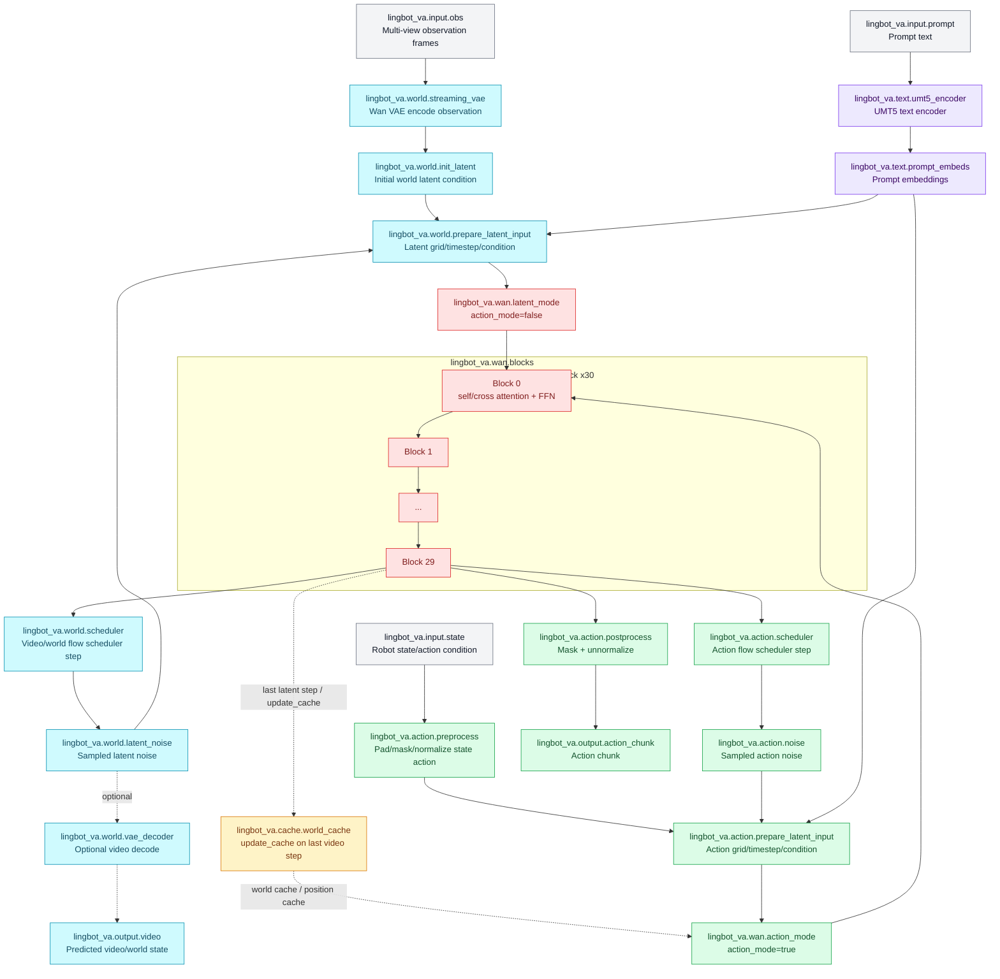

```mermaid
flowchart TD
    obs["lingbot_va.input.obs<br/>Multi-view observation frames"]
    prompt["lingbot_va.input.prompt<br/>Prompt text"]
    state["lingbot_va.input.state<br/>Robot state/action condition"]

    vae["lingbot_va.world.streaming_vae<br/>Wan VAE encode observation"]
    init_latent["lingbot_va.world.init_latent<br/>Initial world latent condition"]
    latent_noise["lingbot_va.world.latent_noise<br/>Sampled latent noise"]
    text_enc["lingbot_va.text.umt5_encoder<br/>UMT5 text encoder"]
    text_emb["lingbot_va.text.prompt_embeds<br/>Prompt embeddings"]

    latent_input["lingbot_va.world.prepare_latent_input<br/>Latent grid/timestep/condition"]
    latent_mode["lingbot_va.wan.latent_mode<br/>action_mode=false"]
    latent_sched["lingbot_va.world.scheduler<br/>Video/world flow scheduler step"]
    cache["lingbot_va.cache.world_cache<br/>update_cache on last video step"]

    action_pre["lingbot_va.action.preprocess<br/>Pad/mask/normalize state action"]
    action_noise["lingbot_va.action.noise<br/>Sampled action noise"]
    action_input["lingbot_va.action.prepare_latent_input<br/>Action grid/timestep/condition"]
    action_mode["lingbot_va.wan.action_mode<br/>action_mode=true"]
    action_sched["lingbot_va.action.scheduler<br/>Action flow scheduler step"]
    action_post["lingbot_va.action.postprocess<br/>Mask + unnormalize"]
    action_out["lingbot_va.output.action_chunk<br/>Action chunk"]

    decoder["lingbot_va.world.vae_decoder<br/>Optional video decode"]
    video_out["lingbot_va.output.video<br/>Predicted video/world state"]

    subgraph wan_stack["lingbot_va.wan.blocks<br/>Shared WanTransformer3D Stack x30"]
        wan_b0["Block 0<br/>self/cross attention + FFN"]
        wan_b1["Block 1"]
        wan_dots["..."]
        wan_b29["Block 29"]
        wan_b0 --> wan_b1 --> wan_dots --> wan_b29
    end

    obs --> vae --> init_latent --> latent_input
    prompt --> text_enc --> text_emb --> latent_input
    latent_noise --> latent_input --> latent_mode --> wan_b0
    wan_b29 --> latent_sched --> latent_noise
    wan_b29 -. last latent step / update_cache .-> cache
    latent_noise -. optional .-> decoder -.-> video_out

    state --> action_pre --> action_input
    action_noise --> action_input
    text_emb --> action_input
    cache -. world cache / position cache .-> action_mode
    action_input --> action_mode --> wan_b0
    wan_b29 --> action_sched --> action_noise
    wan_b29 --> action_post --> action_out

    classDef input fill:#f3f4f6,stroke:#6b7280,color:#111827;
    classDef world fill:#cffafe,stroke:#0891b2,color:#164e63;
    classDef text fill:#ede9fe,stroke:#7c3aed,color:#3b0764;
    classDef action fill:#dcfce7,stroke:#16a34a,color:#14532d;
    classDef core fill:#fee2e2,stroke:#dc2626,color:#7f1d1d;
    classDef cache fill:#fef3c7,stroke:#d97706,color:#78350f;
    classDef output fill:#fce7f3,stroke:#db2777,color:#831843;

    class obs,prompt,state input;
    class vae,init_latent,latent_noise,latent_input,latent_sched,decoder,video_out world;
    class text_enc,text_emb text;
    class action_pre,action_noise,action_input,action_sched,action_post,action_out,action_mode action;
    class latent_mode,wan_b0,wan_b1,wan_dots,wan_b29 core;
    class cache cache;
```
