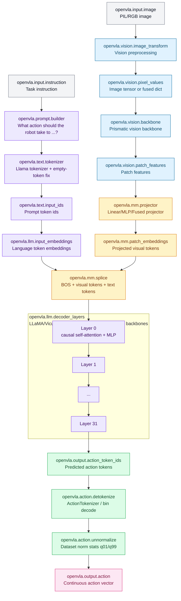

```mermaid
flowchart TD
    image["openvla.input.image<br/>PIL/RGB image"]
    instr["openvla.input.instruction<br/>Task instruction"]

    prompt["openvla.prompt.builder<br/>What action should the robot take to ...?"]
    tokenizer["openvla.text.tokenizer<br/>Llama tokenizer + empty-token fix"]
    input_ids["openvla.text.input_ids<br/>Prompt token ids"]

    img_tf["openvla.vision.image_transform<br/>Vision preprocessing"]
    pixels["openvla.vision.pixel_values<br/>Image tensor or fused dict"]
    vision["openvla.vision.backbone<br/>Prismatic vision backbone"]
    patches["openvla.vision.patch_features<br/>Patch features"]
    projector["openvla.mm.projector<br/>Linear/MLP/Fused projector"]
    patch_emb["openvla.mm.patch_embeddings<br/>Projected visual tokens"]

    tok_emb["openvla.llm.input_embeddings<br/>Language token embeddings"]
    splice["openvla.mm.splice<br/>BOS + visual tokens + text tokens"]
    action_ids["openvla.output.action_token_ids<br/>Predicted action tokens"]

    detok["openvla.action.detokenize<br/>ActionTokenizer / bin decode"]
    unnorm["openvla.action.unnormalize<br/>Dataset norm stats q01/q99"]
    out["openvla.output.action<br/>Continuous action vector"]

    subgraph llm_stack["openvla.llm.decoder_layers<br/>LLaMA/Vicuna causal decoder stack x32 for 7B backbones"]
        llm_l0["Layer 0<br/>causal self-attention + MLP"]
        llm_l1["Layer 1"]
        llm_dots["..."]
        llm_l31["Layer 31"]
        llm_l0 --> llm_l1 --> llm_dots --> llm_l31
    end

    instr --> prompt --> tokenizer --> input_ids --> tok_emb --> splice
    image --> img_tf --> pixels --> vision --> patches --> projector --> patch_emb --> splice
    splice --> llm_l0
    llm_l31 --> action_ids --> detok --> unnorm --> out

    classDef input fill:#f3f4f6,stroke:#6b7280,color:#111827;
    classDef vision fill:#e0f2fe,stroke:#0369a1,color:#0c4a6e;
    classDef text fill:#ede9fe,stroke:#7c3aed,color:#3b0764;
    classDef mm fill:#fef3c7,stroke:#d97706,color:#78350f;
    classDef action fill:#dcfce7,stroke:#16a34a,color:#14532d;
    classDef output fill:#fce7f3,stroke:#db2777,color:#831843;

    class image,instr input;
    class img_tf,pixels,vision,patches vision;
    class prompt,tokenizer,input_ids,tok_emb,llm_l0,llm_l1,llm_dots,llm_l31 text;
    class projector,patch_emb,splice mm;
    class action_ids,detok,unnorm action;
    class out output;
```
