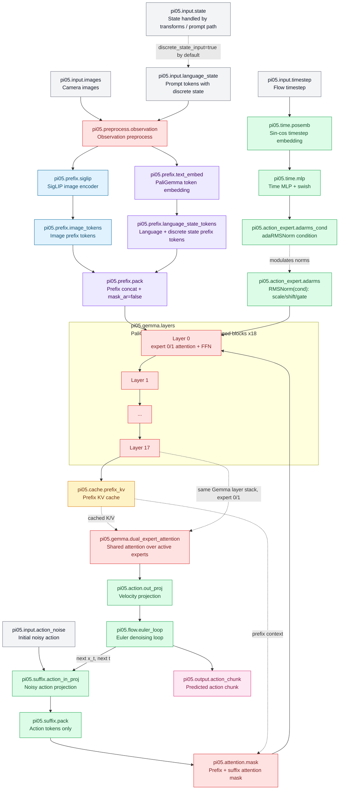

```mermaid
flowchart TD
    img["pi05.input.images<br/>Camera images"]
    lang_state["pi05.input.language_state<br/>Prompt tokens with discrete state"]
    state_note["pi05.input.state<br/>State handled by transforms / prompt path"]
    noise["pi05.input.action_noise<br/>Initial noisy action"]
    step_t["pi05.input.timestep<br/>Flow timestep"]

    preprocess["pi05.preprocess.observation<br/>Observation preprocess"]
    siglip["pi05.prefix.siglip<br/>SigLIP image encoder"]
    img_tokens["pi05.prefix.image_tokens<br/>Image prefix tokens"]
    text_embed["pi05.prefix.text_embed<br/>PaliGemma token embedding"]
    text_tokens["pi05.prefix.language_state_tokens<br/>Language + discrete state prefix tokens"]
    prefix_pack["pi05.prefix.pack<br/>Prefix concat + mask_ar=false"]

    kv_cache["pi05.cache.prefix_kv<br/>Prefix KV cache"]

    action_proj["pi05.suffix.action_in_proj<br/>Noisy action projection"]
    time_pe["pi05.time.posemb<br/>Sin-cos timestep embedding"]
    time_mlp["pi05.time.mlp<br/>Time MLP + swish"]
    adarms["pi05.action_expert.adarms_cond<br/>adaRMSNorm condition"]
    suffix_pack["pi05.suffix.pack<br/>Action tokens only"]

    mask["pi05.attention.mask<br/>Prefix + suffix attention mask"]
    adarms_norm["pi05.action_expert.adarms<br/>RMSNorm(cond): scale/shift/gate"]
    dual_attn["pi05.gemma.dual_expert_attention<br/>Shared attention over active experts"]
    out_proj["pi05.action.out_proj<br/>Velocity projection"]
    euler["pi05.flow.euler_loop<br/>Euler denoising loop"]
    action_out["pi05.output.action_chunk<br/>Predicted action chunk"]

    subgraph gemma_stack["pi05.gemma.layers<br/>PaliGemma expert + action expert scanned blocks x18"]
        gemma_l0["Layer 0<br/>expert 0/1 attention + FFN"]
        gemma_l1["Layer 1"]
        gemma_dots["..."]
        gemma_l17["Layer 17"]
        gemma_l0 --> gemma_l1 --> gemma_dots --> gemma_l17
    end

    img --> preprocess --> siglip --> img_tokens --> prefix_pack
    lang_state --> preprocess --> text_embed --> text_tokens --> prefix_pack
    state_note -. discrete_state_input=true by default .-> lang_state
    prefix_pack --> gemma_l0
    gemma_l17 --> kv_cache

    noise --> action_proj --> suffix_pack
    step_t --> time_pe --> time_mlp --> adarms
    suffix_pack --> mask
    kv_cache -. prefix context .-> mask
    mask --> gemma_l0
    adarms -. modulates norms .-> adarms_norm --> gemma_l0
    kv_cache -. cached K/V .-> dual_attn
    gemma_l17 -. same Gemma layer stack, expert 0/1 .-> dual_attn
    dual_attn --> out_proj --> euler --> action_out
    euler -- next x_t, next t --> action_proj

    classDef input fill:#f3f4f6,stroke:#6b7280,color:#111827;
    classDef vision fill:#e0f2fe,stroke:#0369a1,color:#0c4a6e;
    classDef text fill:#ede9fe,stroke:#7c3aed,color:#3b0764;
    classDef action fill:#dcfce7,stroke:#16a34a,color:#14532d;
    classDef core fill:#fee2e2,stroke:#dc2626,color:#7f1d1d;
    classDef cache fill:#fef3c7,stroke:#d97706,color:#78350f;
    classDef output fill:#fce7f3,stroke:#db2777,color:#831843;

    class img,lang_state,state_note,noise,step_t input;
    class siglip,img_tokens vision;
    class text_embed,text_tokens,prefix_pack text;
    class action_proj,time_pe,time_mlp,adarms,suffix_pack,adarms_norm,out_proj,euler action;
    class preprocess,mask,gemma_l0,gemma_l1,gemma_dots,gemma_l17,dual_attn core;
    class kv_cache cache;
    class action_out output;
```
