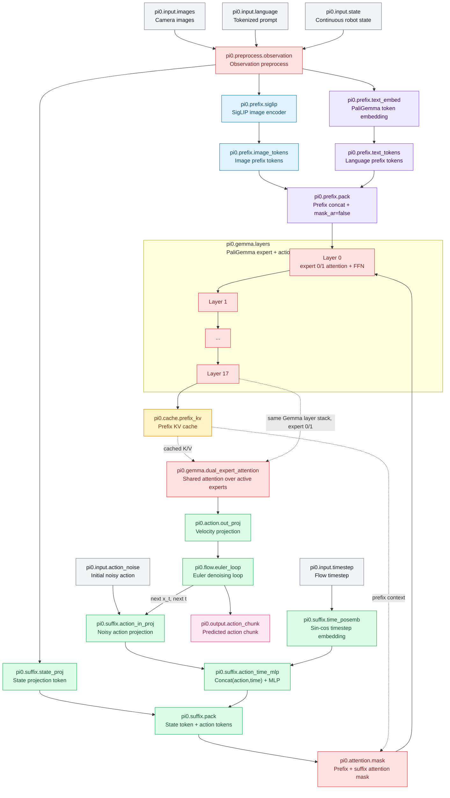

```mermaid
flowchart TD
    img["pi0.input.images<br/>Camera images"]
    lang["pi0.input.language<br/>Tokenized prompt"]
    state["pi0.input.state<br/>Continuous robot state"]
    noise["pi0.input.action_noise<br/>Initial noisy action"]
    step_t["pi0.input.timestep<br/>Flow timestep"]

    preprocess["pi0.preprocess.observation<br/>Observation preprocess"]
    siglip["pi0.prefix.siglip<br/>SigLIP image encoder"]
    img_tokens["pi0.prefix.image_tokens<br/>Image prefix tokens"]
    text_embed["pi0.prefix.text_embed<br/>PaliGemma token embedding"]
    text_tokens["pi0.prefix.text_tokens<br/>Language prefix tokens"]
    prefix_pack["pi0.prefix.pack<br/>Prefix concat + mask_ar=false"]

    kv_cache["pi0.cache.prefix_kv<br/>Prefix KV cache"]

    state_proj["pi0.suffix.state_proj<br/>State projection token"]
    action_proj["pi0.suffix.action_in_proj<br/>Noisy action projection"]
    time_pe["pi0.suffix.time_posemb<br/>Sin-cos timestep embedding"]
    time_mix["pi0.suffix.action_time_mlp<br/>Concat(action,time) + MLP"]
    suffix_pack["pi0.suffix.pack<br/>State token + action tokens"]

    mask["pi0.attention.mask<br/>Prefix + suffix attention mask"]
    dual_attn["pi0.gemma.dual_expert_attention<br/>Shared attention over active experts"]
    out_proj["pi0.action.out_proj<br/>Velocity projection"]
    euler["pi0.flow.euler_loop<br/>Euler denoising loop"]
    action_out["pi0.output.action_chunk<br/>Predicted action chunk"]

    subgraph gemma_stack["pi0.gemma.layers<br/>PaliGemma expert + action expert scanned blocks x18"]
        gemma_l0["Layer 0<br/>expert 0/1 attention + FFN"]
        gemma_l1["Layer 1"]
        gemma_dots["..."]
        gemma_l17["Layer 17"]
        gemma_l0 --> gemma_l1 --> gemma_dots --> gemma_l17
    end

    img --> preprocess --> siglip --> img_tokens --> prefix_pack
    lang --> preprocess --> text_embed --> text_tokens --> prefix_pack
    prefix_pack --> gemma_l0
    gemma_l17 --> kv_cache

    state --> preprocess --> state_proj --> suffix_pack
    noise --> action_proj --> time_mix --> suffix_pack
    step_t --> time_pe --> time_mix

    suffix_pack --> mask
    kv_cache -. prefix context .-> mask
    mask --> gemma_l0
    kv_cache -. cached K/V .-> dual_attn
    gemma_l17 -. same Gemma layer stack, expert 0/1 .-> dual_attn
    dual_attn --> out_proj --> euler --> action_out
    euler -- next x_t, next t --> action_proj

    classDef input fill:#f3f4f6,stroke:#6b7280,color:#111827;
    classDef vision fill:#e0f2fe,stroke:#0369a1,color:#0c4a6e;
    classDef text fill:#ede9fe,stroke:#7c3aed,color:#3b0764;
    classDef action fill:#dcfce7,stroke:#16a34a,color:#14532d;
    classDef core fill:#fee2e2,stroke:#dc2626,color:#7f1d1d;
    classDef cache fill:#fef3c7,stroke:#d97706,color:#78350f;
    classDef output fill:#fce7f3,stroke:#db2777,color:#831843;

    class img,lang,state,noise,step_t input;
    class siglip,img_tokens vision;
    class text_embed,text_tokens,prefix_pack text;
    class state_proj,action_proj,time_pe,time_mix,suffix_pack,out_proj,euler action;
    class preprocess,mask,gemma_l0,gemma_l1,gemma_dots,gemma_l17,dual_attn core;
    class kv_cache cache;
    class action_out output;
```
