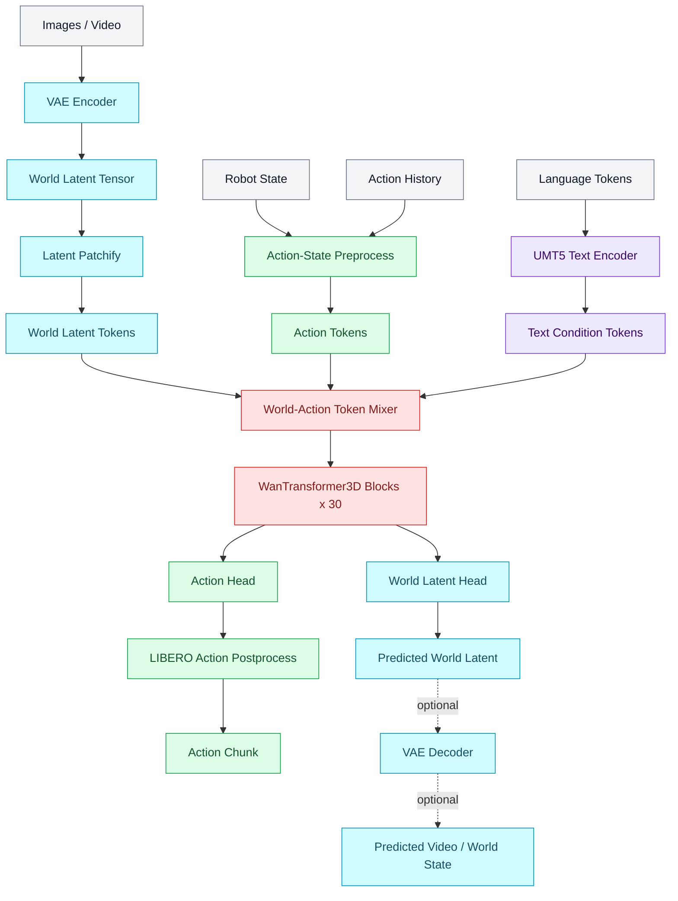

```mermaid
flowchart TD
    VID[Images / Video] --> VAE[VAE Encoder]
    VAE --> LAT[World Latent Tensor]
    LAT --> PATCH[Latent Patchify]
    PATCH --> WTOK[World Latent Tokens]

    LANG[Language Tokens] --> UMT5[UMT5 Text Encoder]
    UMT5 --> TXT[Text Condition Tokens]

    STATE[Robot State] --> ASP[Action-State Preprocess]
    HIST[Action History] --> ASP
    ASP --> ATOK[Action Tokens]

    WTOK --> MIX[World-Action Token Mixer]
    ATOK --> MIX
    TXT --> MIX

    MIX --> WAN[WanTransformer3D Blocks x 30]

    WAN --> WHEAD[World Latent Head]
    WAN --> AHEAD[Action Head]

    WHEAD --> WPRED[Predicted World Latent]
    AHEAD --> APOST[LIBERO Action Postprocess]
    APOST --> AOUT[Action Chunk]

    WPRED -. optional .-> VDEC[VAE Decoder]
    VDEC -. optional .-> VIDEO[Predicted Video / World State]

    classDef input fill:#f3f4f6,stroke:#6b7280,color:#111827;
    classDef world fill:#cffafe,stroke:#0891b2,color:#164e63;
    classDef text fill:#ede9fe,stroke:#7c3aed,color:#3b0764;
    classDef action fill:#dcfce7,stroke:#16a34a,color:#14532d;
    classDef core fill:#fee2e2,stroke:#dc2626,color:#7f1d1d;

    class VID,LANG,STATE,HIST input;
    class VAE,LAT,PATCH,WTOK,WHEAD,WPRED,VDEC,VIDEO world;
    class UMT5,TXT text;
    class ASP,ATOK,AHEAD,APOST,AOUT action;
    class MIX,WAN core;
```
