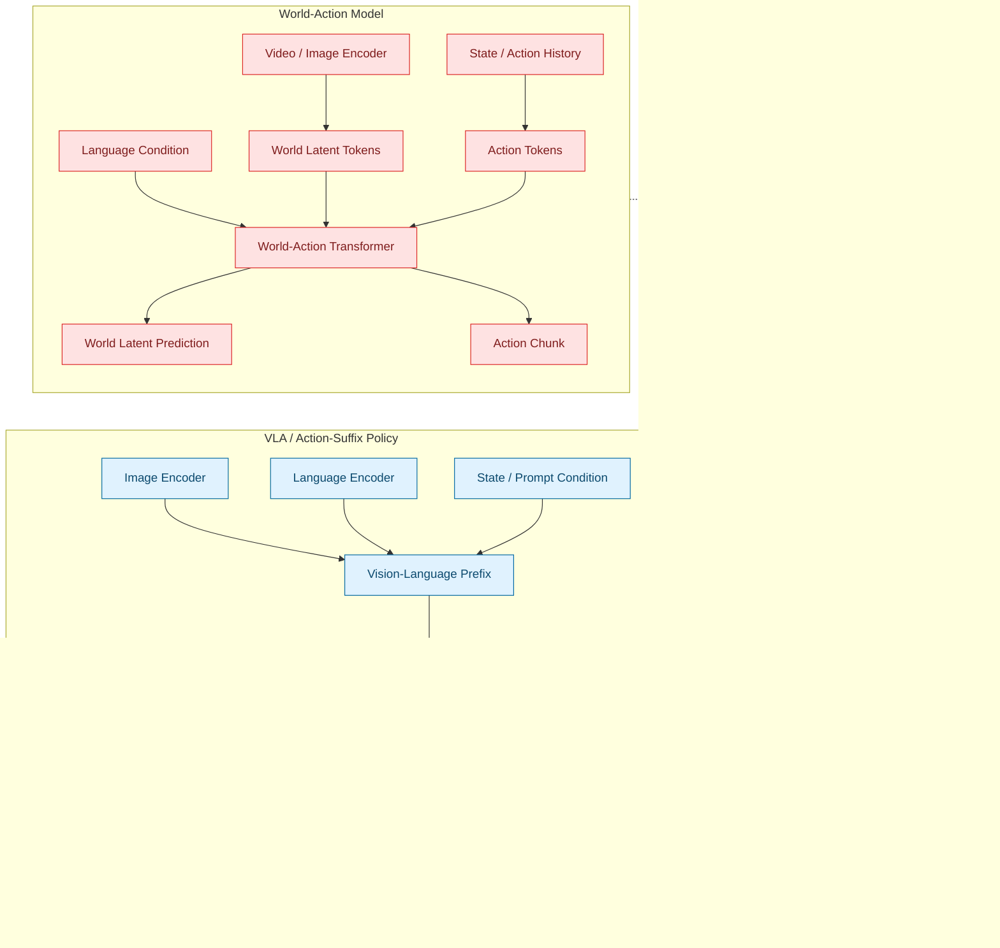

```mermaid
flowchart LR
    subgraph VLA["VLA / Action-Suffix Policy"]
        VI[Image Encoder] --> VP[Vision-Language Prefix]
        VL[Language Encoder] --> VP
        VS[State / Prompt Condition] --> VP
        VP --> VKV[Prefix KV Cache]
        VN[Action Noise] --> VA[Action Expert / Flow Decoder]
        VT[Flow Timestep] --> VA
        VKV --> VA
        VA --> VO[Action Chunk]
    end

    subgraph WAM["World-Action Model"]
        WI[Video / Image Encoder] --> WL[World Latent Tokens]
        WS[State / Action History] --> WA[Action Tokens]
        WG[Language Condition] --> WM[World-Action Transformer]
        WL --> WM
        WA --> WM
        WM --> WW[World Latent Prediction]
        WM --> WO[Action Chunk]
    end

    VLA -. action-only output .-> VNOTE[Policy predicts action chunk]
    WAM -. joint output .-> WNOTE[Model predicts action and world latent]

    classDef vla fill:#e0f2fe,stroke:#0369a1,color:#0c4a6e;
    classDef wam fill:#fee2e2,stroke:#dc2626,color:#7f1d1d;
    classDef note fill:#fef3c7,stroke:#d97706,color:#78350f;

    class VI,VP,VL,VS,VKV,VN,VT,VA,VO vla;
    class WI,WL,WS,WA,WG,WM,WW,WO wam;
    class VNOTE,WNOTE note;
```
